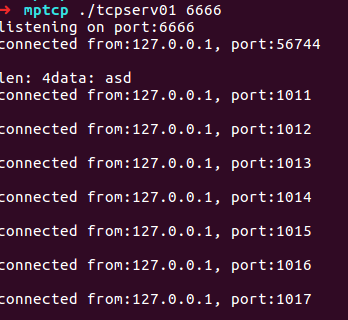
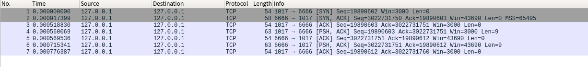

# raw socket 实现建立TCP连接

最近由于项目需要对四层以下的协议添加一些支持，因此就想到了自定义TCP协议。

需要使用的方式就是raw socket，此处我们使用python 语言。

## 测试客户端

此处我们先使用一个简单的c语言的tcp服务器作为被测试目标。

这个服务器的功能就是简单的 [接受数据] ---> [返回数据]

```c
// tcpserv.c
#include <netinet/in.h>    // for sockaddr_in
#include <sys/types.h>    // for socket
#include <sys/socket.h>    // for socket
#include <stdio.h>        // for printf
#include <stdlib.h>        // for exit
#include <string.h>        // for bzero
#include <arpa/inet.h>     // inet_ntoa

#define LISTENQ 20
#define MAXLINE 10000
int SERV_PORT=6666;

void
str_echo(int sockfd)
{
	long		arg1, arg2;
	ssize_t		n;
	char		line[MAXLINE];

	for ( ; ; ) {
		if ( (n = recv(sockfd, line, MAXLINE, 0)) == 0)
			return;		/* connection closed by other end */
		n = strlen(line);
        printf("len: %d \n", n);
		printf("data: %s", line);
		send(sockfd, line, n, 0);
		memset(line, 0, MAXLINE);
	}
}

int
main(int argc, char **argv)
{
	int					listenfd, connfd;
	pid_t				childpid;
	socklen_t			clilen;
	struct sockaddr_in	cliaddr, servaddr;
  
  if (argc > 2){
    printf("usage: tcpserv [port]\n");
    exit(0);
  }
  if (argc == 2){
    printf("listening on port:%s\n", argv[1]);
    SERV_PORT = atoi(argv[1]);
  }

	listenfd = socket(AF_INET, SOCK_STREAM, 0);

	bzero(&servaddr, sizeof(servaddr));
	servaddr.sin_family      = AF_INET;
	servaddr.sin_addr.s_addr = htonl(INADDR_ANY);
	servaddr.sin_port        = htons(SERV_PORT);

	bind(listenfd, (struct sockaddr*) &servaddr, sizeof(servaddr));

	listen(listenfd, LISTENQ);

	for ( ; ; ) {
		clilen = sizeof(cliaddr);
		connfd = accept(listenfd, (struct sockaddr*) &cliaddr, &clilen);
		printf("connected from:%s, port:%d \n\n", inet_ntoa(cliaddr.sin_addr), ntohs(cliaddr.sin_port));
		if ( (childpid = fork()) == 0) {	/* child process */
			close(listenfd);	/* close listening socket */
			str_echo(connfd);	/* process the request */
			exit(0);
		}
		close(connfd);			/* parent closes connected socket */
	}
	return 0;
}
```

运行

```bash
gcc tcpserv.c -o tcpserv
./tcpserv 6666              #监听6666端口
```

## 编写 raw socket 客户端

### 一些问题

此处列举了在编写代码中遇到的问题，具体代码见下一节

#### 1. 如何创建套接字

因为我们需要自定义连接，所以我们只需要从 TCP header 开始构建就可以了（当然也可以从 IP header 开始构建，但是那样并没有什么特殊的意义，并且会增加一些工作量），构建的方式就是

```python
s = socket.socket(socket.AF_INET, socket.SOCK_RAW, socket.IPPROTO_TCP)
```

#### 2. 创建了套接字之后如何发送数据

就直接通过 pack 函数一个字节一个字节地打包数据就可以了，注意使用网络字节序

#### 3. 如何接受数据

我们创建的套接字，无论是TCP还是UDP，都能够通过 `recvfrom`函数接收数据包。

**它所接收的数据包是本机收到的所有 TCP数据包/UDP数据包 的一份拷贝**

意思就是说开多个进程可以同时接受所有的数据包，并且需要注意的一点事，就算是我们当前进程发送的数据包也是会被接受到的，因此最后进行 wireshark 抓包的时候需要进行一些筛选，否则显示的数据量太大了

#### 4. 如何处理内核发出的 RST 包

在发包过程中我们会发现，每当我们发出一个自定义的 SYN 包之后，接收到对端发挥的 SYN+ACK，这个时候内核就会发送一个 RST 包强行中断这个连接，以为内核需要管理所有的TCP连接，一旦受到未知连接的TCP包就会强行中断这个连接。为了解决这个问题有两种思路：

思路一：创建一个伪装TCP连接，也就是先通过 SOCK_STREAM 创建一个真正的套接字并且使用 `connect` 函数建立连接，然后使用 raw socket 在这个连接的端口上进行收发包。这种方式的问题在于，因为我们使用的是系统的自带的协议栈建立的连接，因此就没法获取到连接建立时所商定的 ISN（初始序列号），因此后续发包过程中就不能正确发包。

思路二：参照 stackoverflow 上的一个大佬的回答，通过修改 iptables 的 filter 表将内核发出的 RST 包给过滤掉，这样就能建立连接了。

因为我们的服务器监听的是6666端口，因此修改语句就是：

```bash
iptables -t filter -I OUTPUT -p tcp --dport 6666 --tcp-flags RST RST -j DROP
```

### 客户端代码

```python
# -*- coding: utf-8 -*
import sys, socket
from struct import *
import str2asc


def carry_around_add(a, b):
    c = a + b
    return (c & 0xffff) + (c >> 16)

def checksum(msg):
    s = 0
    for i in range(0, len(msg), 2):
        w = (ord(msg[i]) << 8 ) + ord(msg[i+1])
        s = carry_around_add(s, w)
    return ~s & 0xffff


def raw_tcp(s, src_ip, src_port, dst_ip, dst_port, seq, ack_seq, syn_flag=0, ack_flag=1, psh_flag=0
            , payload_data=''):

    ip_source = src_ip
    ip_dest = dst_ip
    ip_protocol = socket.IPPROTO_TCP

    #  tcp header
    tcp_sport = src_port	        # source port
    tcp_dport = dst_port		# destination port
    tcp_seq = seq	    # 32-bit sequence number，这里随便指定个
    tcp_ack_seq = ack_seq		    # 32-bit ACK number。这里不准备构建ack包，故设为0
    tcp_data_offset = 5	    # 和ip header一样，没option field
    # 下面是各种tcp flags
    tcp_flag_urg = 0
    tcp_flag_ack = ack_flag
    tcp_flag_psh = psh_flag
    tcp_flag_rst = 0
    tcp_flag_syn = syn_flag
    tcp_flag_fin = 0

    tcp_window_size = 3000
    tcp_checksum = 0
    tcp_urgent_ptr = 0

    # 继续合并small fields
    tcp_offset_reserv = (tcp_data_offset << 4)
    tcp_flags = tcp_flag_fin + (tcp_flag_syn << 1) + (tcp_flag_rst << 2) + (tcp_flag_psh <<3) + (tcp_flag_ack << 4) + (tcp_flag_urg << 5)

    # 按上面描述的结构，构建tcp header。
    tcp_header = pack('!HHLLBBHHH' , tcp_sport, tcp_dport, tcp_seq, tcp_ack_seq, tcp_offset_reserv, tcp_flags, tcp_window_size, tcp_checksum, tcp_urgent_ptr)

    # 写点东西作为data部分(可选)
    # payload_data = 'wordpress.youran.me'

    # 构建pseudo ip header
    psh_saddr = socket.inet_pton(socket.AF_INET, ip_source)
    psh_daddr = socket.inet_pton(socket.AF_INET, ip_dest)
    psh_reserved = 0
    psh_protocol = ip_protocol
    psh_tcp_len = len(tcp_header) + len(payload_data)
    psh = pack('!4s4sBBH', psh_saddr, psh_daddr, psh_reserved, psh_protocol, psh_tcp_len)

    # 创建最终用于checksum的内容
    chk = psh + tcp_header + payload_data

    # 必要时追加1字节的padding
    if len(chk) % 2 != 0:
        chk += '\0'

    tcp_checksum = checksum(chk)

    # 重新构建tcp header，把checksum结果填进去
    tcp_header = pack('!HHLLBBHHH' , tcp_sport, tcp_dport, tcp_seq, tcp_ack_seq, tcp_offset_reserv, tcp_flags, tcp_window_size, tcp_checksum, tcp_urgent_ptr)

    # 最终的tcp/ip packet
    packet = tcp_header + payload_data
    # 发送出去
    s.sendto(packet, (ip_dest, 0))

if __name__ == '__main__':
    src_ip = '127.0.0.1'
    src_port = 1017
    dst_ip = '127.0.0.1'
    dst_port = 6666

    # fake_sock = socket.socket(socket.AF_INET, socket.SOCK_STREAM, socket.IPPROTO_TCP)
    # fake_sock.bind((src_ip, src_port))
    # fake_sock.connect((dst_ip, dst_port))
    try:
        s = socket.socket(socket.AF_INET, socket.SOCK_RAW, socket.IPPROTO_TCP)
        # s = socket.socket(socket.AF_INET, socket.SOCK_STREAM, socket.IPPROTO_TCP)
    except socket.error , msg:
        print 'Socket could not be created. Error Code : ' + str(msg[0]) + ' Message ' + msg[1]
        sys.exit()

    seqNum = 19890602 #随便初始化的一个值
    ackNum = 0
    # syn
    raw_tcp(s, src_ip, src_port, dst_ip, dst_port, seq=seqNum, ack_seq=ackNum, syn_flag=1, ack_flag=0)

    for i in range(2):
        data, addr = s.recvfrom(1024)
        print addr
        print data
        print 'len: ', len(data)
        print 'seq: ', unpack('!I', data[24:28])
        ackNum = unpack('!I', data[24:28])[0]+1
        print 'ack: ', unpack('!I', data[28:32])
        str2asc.printBinary(data)

    # ack
    raw_tcp(s, src_ip, src_port, dst_ip, dst_port, seq=seqNum+1, ack_seq=ackNum)
    # psh + payload
    payload = "hello raw"
    raw_tcp(s, src_ip, src_port, dst_ip, dst_port, seq=seqNum+1, ack_seq=ackNum, psh_flag=1, payload_data='hello raw')
    for i in range(4):
        data, addr = s.recvfrom(1024)

    # 对于服务器返回值的ack
    raw_tcp(s, src_ip, src_port, dst_ip, dst_port, seq=seqNum+1+len(payload), ack_seq=ackNum+len(payload))
```

## 运行结果

服务器显示结果，此处的port对应代码中的 src_port



抓包结果：



可以看到成功建立了连接并且受到了服务端（6666端口的）返回数据。

但是很奇怪的就是虽然受到了服务器的返回值，但是在服务器那边的terminal中并没有显示接收到的数据，仅仅显示建立了连接。

## 总结

这个小程序虽说没有什么使用意义，但是在编写的过程中增进了我对于socket通信的理解，也算是实现了一个简单的tcp协议栈吧（当然没有考虑各种其他flag、窗口、option等等......）。如果有其他问题欢迎指出来。